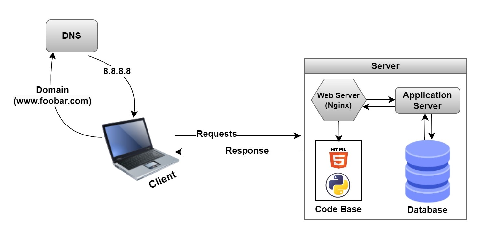

# 0. Simple web stack

## What is a server? Serve & Service
A server is a piece of computer hardware or software that provides functionality for other programs or devices (clients) . Data center that consists of one or more clusters of computers that are connected together to process the requests received from the web server & application server and maybe to get the data requested from the database too.

## What type of DNS record www is in www.foobar.com?
CNAME record because www is considered to be a (sub domain for the world wide web) generally and so adding that “www” will be like routing it to the world wide web to look for the domain request using HTTP requests.

## What is the role of the web server?
It’s what’s processing the HTTP requests sent from the client/user to the Internet, AKA HTTP server too. It’ll look for the IP for the domain in the HTTP request to get the domain representing it and start processing the other requests that will be later sent from the user end.

## What is the role of the application server?
It’s the server that hosts the code base (application files) which could be a physical machine or a virtual machine (VM) that will process the requests that haven’t been handled by the web server because they needed to be interpreted first according to the programming language it was written in.

## What is the role of the database?
It saves the data into a storage to be able to retrieve it whenever needed/queried by the server, processed requests or queried by the developers or the end users depending on which data is accessible for each for sure or the granted permissions.

## What is the server using to communicate with the computer of the user requesting the website?
The web server handles the HTTP requests, if those requests need further processing they’ll be routed to the application server to handle them or retrieved back from the code base if valid.

## You must be able to explain what the issues are with this infrastructure:

### SPOF: Single Point Of Failure
If any part of that server failed or went down for any reason, the whole system will be jeopardized and the domain won’t be accessed which is considered as a SPOF in the design of that infrastructure.

### Downtime when maintenance needed (like deploying new code web server needs to be restarted)
Whenever we try to update any part of the code or have any maintenance, that will prevent users/visitors from being able to access the website because the domain is only counting on one server so once it’s in maintenance phase, the domain will be inaccessible.

### Cannot scale if too much incoming traffic
The server won’t be able to handle the load or much of traffic than its limitations which might cause issues and even get the server down for a failure in handling the lots of requests and traffic passed on to it, which is why it’s advisable to have more than one server with load balancer to split that traffic and requests between different servers according to each server’s capabilities.
