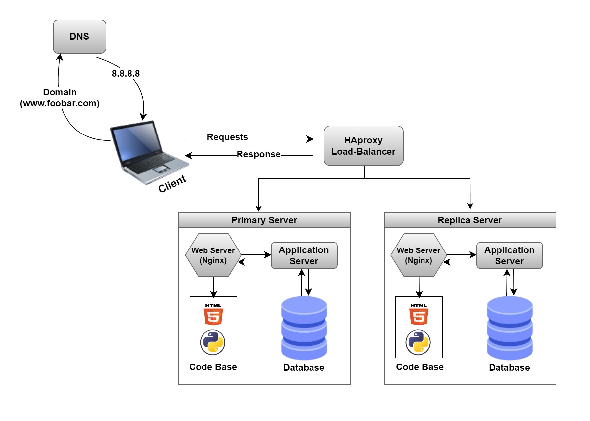

# 1. Distributed web infrastructure

## For every additional element, why you are adding it?
### Load balancer:
Enhancing the resilience and minimizing downtime during maintenance activities, such as deploying new code that requires restarting the web server.

## What distribution algorithm your load balancer is configured with and how it works
### Least Connection:
This algorithm directs new requests to the server with the fewest active connections. It can help distribute load more evenly if there are fluctuations in traffic between the two servers.

## Is your load-balancer enabling an Active-Active or Active-Passive setup, explain the difference between both?
### Active-Active:
1. Both servers are actively serving traffic simultaneously.
2. It provides redundancy and fault tolerance as if one server fails the other can continue to handle the entire load.

### Active-Passive:
1. One server handles all incoming traffic while the other server remains idle or serves as standby.
2. While it provides redundancy and failover capability it may result in under utilization of resources, because passive nodes remain idle most of the time.

In the used algorithm “least connections” this typically goes well with the “Active-Active” configuration because multiple servers are actively serving traffic. Leading to effectively balancing the load across the servers.

## How a database Primary-Replica (Master-Slave) cluster works?
When the load balancer checks the primary cluster for the requests that can handle, if it found that it’s already at its most capacity, it’ll route the rest of the requests to the next in line; the replica cluster to handle them, or if the primary cluster server been in maintenance or down for any reason, the requests will be routed to the replica cluster so that it won’t affect the accessibility of the domain or the database.

## What is the difference between the Primary node and the Replica node in regard to the application?
### Primary Node:
1. Authoritative source for read-write operations.
2. All write operations are performed in it.
3. Responsible for handling transactions, enforcing constraints and maintaining data integrity.

### Replica Node:
1. Are read-only copies of the primary node’s data.
2. Receives replicated data from primary node and keeps a copy.
3. Serves as hot standby instances providing redundancy and fault tolerance in case of primary’s Fail.

## You must be able to explain what the issues are with this infrastructure?
### Where are SPOF?
( Hardware - Software - network - power/electrical systems - Human error ).

### Security issues (no firewall, no HTTPS)
Firewall without it your system/network is vulnerable to unauthorized access, malware infections, and various types of cyber-attacks. Attackers can exploit unprotected ports and services to gain unauthorized access to your system which will lead to stealing sensitive data.

No HTTPS it encrypts data transmitted between a web browser and a web server without it all transmitted data including payment information and sensitive personal data can easily be intercepted and manipulated by attackers as it's going to be sent as plain text. Attackers can use the MITM (man in the middle) attacks on communication between users and the server to steal data and inject malicious content into web pages.

### No monitoring
When no monitoring you can’t detect security incidents like unauthorized behaviors, breaches. You will not be able to track and ensure the performance, server failures, network outages, disk space exhaustion and the availability of your systems or your network.
