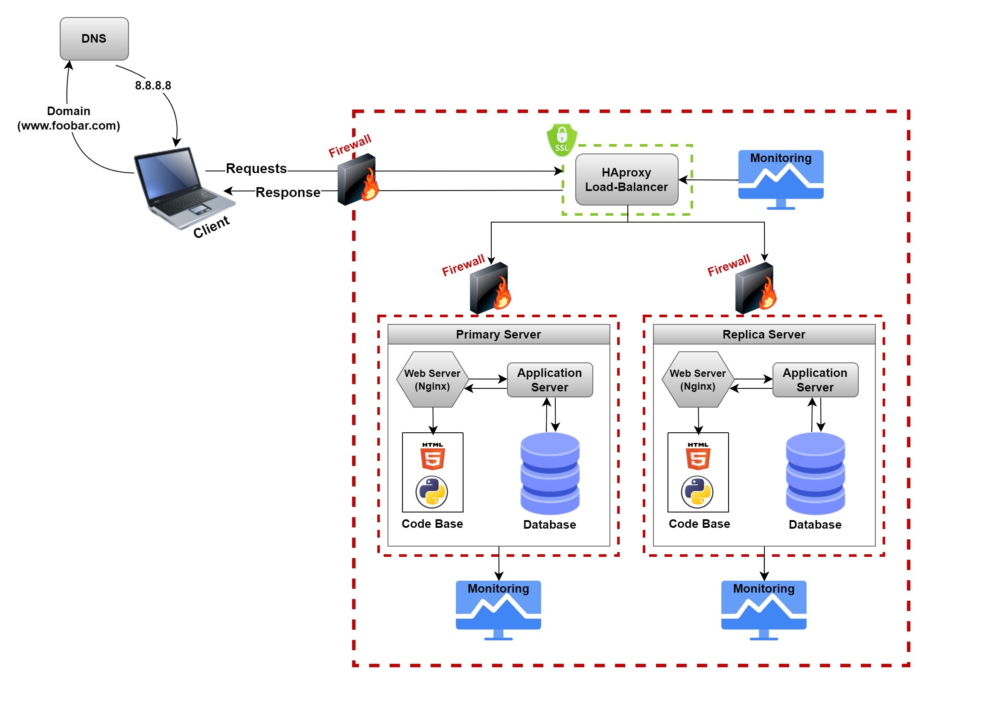

# 2. Secured and monitored web infrastructure

## What are firewalls for?
To filter the requests sent to the server if it’s secured or not, if it’s, then it’ll be allowed to pass the firewall accessing the server and its components, if it wasn’t, then those requests will be blocked.

## Why is the traffic served over HTTPS?
Because HTTPS is the secured version for HTTP which acts as another layer of protection that filters the traffic if it’s safe or risky.

## What monitoring is used for?
( Infrastructure monitoring - applications monitoring - network monitoring - security monitoring - security monitoring - performance monitoring - capacity planning - business process monitoring ).

## How the monitoring tool is collecting data?
It collects data from sources within the IT environment to provide insights into the health, performance, and security of systems, networks and applications.
1. Agent based monitoring where agents collect data from the local system including system metrics , resource utilization, log files.
2. Agentless monitoring does not require the installation of monitoring agents on individual instead tool use protocols such as SNMP (simple network management protocol) ssh(secure shell).
3. Other tools that collect data - API integration - Log monitoring - Packet capture.

## Explain what to do if you want to monitor your web server QPS?
Setting a monitor tool, configure the metric collection, design the dashboards needed to visualize the Query Per Seconds and other metrics, then setting the limits for alerts.

## You must be able to explain what the issues are with this infrastructure:

### Why terminating SSL at the load balancer level is an issue?
Because one of the problems that might happen is the insecure connection between the user/client and the server because any request sent between them would be unencrypted and anyone can intercept that.

### Why having only one MySQL server capable of accepting writes is an issue?
Because it’d be considered as a SPOF, if it’s down then all data will be unreachable. So even if we have another server but the primary MySQL/database server was down, the other database server is a read-only replica that won’t be able to handle storing new data or retrieving the old one because the original database is already down.

### Why having servers with all the same components (database, web server and application server) might be a problem?
Because each of those servers would need different components from storage or memory, or processor and speed needed to handle the requests it gets or the queries, for example, database server would need a bigger storage than the other types of servers, web servers might need a powerful processor to handle the requests as fast as possible, and so on ..
