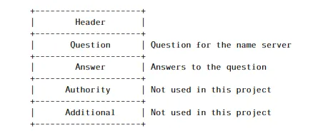
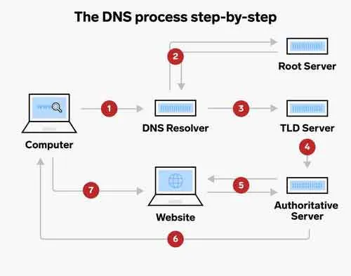
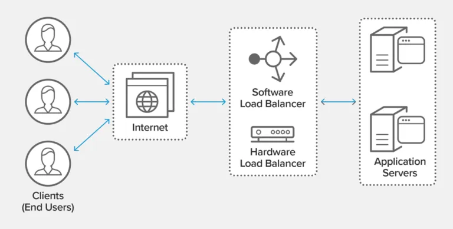
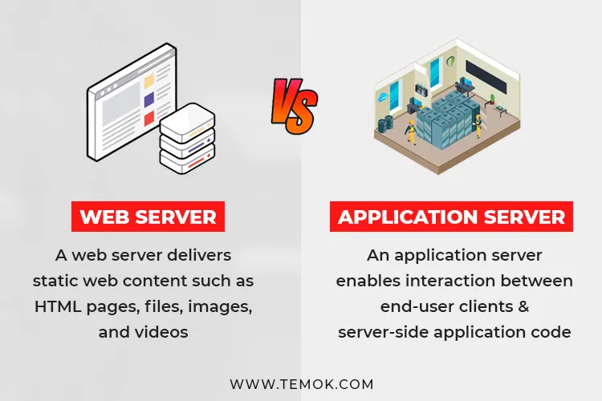
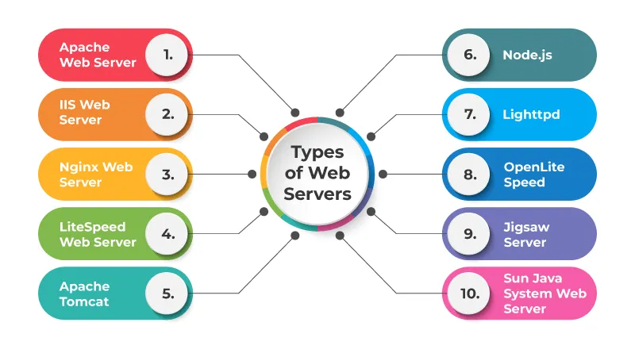

Well, first of all, let’s have a look at how this works...

Let’s assume that someone is using their laptop, trying to access Google to search for something, so he’ll have to type the domain name for that site; Google, which is globally known to be www.google.com but once he types that link in his address bar in his browser, several steps will be taken underneath. For starters, the browser doesn’t know what he just typed in, because browsers mainly understand IP addresses. So the following process will take place:

A DNS request will be sent from the browser to the local DNS resolver on the user’s laptop to get its IP address. But maybe the user’s DNS resolver doesn’t have it, so it’ll send a query to the root DNS server. Those root servers have the location of all TLDs (Top Level Domain) servers; which keeps all the information about all domain extensions .. whether it was .com, .net, .org, or whatever, so once it gets that query, it’ll send back the location of the .com servers.

Routing the query to the .com TLD server, to find the Authoritative DNS server of www.google.com. Once again the query this time, will head to the Authoritative DNS server asking for that domain to be checked in the database to find its IP address. So now finally we have the IP address and it’ll be sent back to the user’s laptop. That process is called “Recursive DNS Query”.

Usually, those DNS queries will be partitioned into sections to include; header, question, answer, authority, and some other information.

##### Source: https://bunny.net/academy/dns/what-is-a-dns-and-recursive-query/

##### Source: https://www.holygamerz.com/en/what-is-a-dns-server-explained-easy

Then the data received needs to be accurate so here comes the beauty of the TCP/IP (Transmission Control Protocol/ Internet Protocol) model which mostly consists of 4 or 5 layers that are mainly used to divide the data into packets to be faster in transferring and to be combined at the end when it reaches its destination after going through those layers;

- Application Layer
- Transport Layer(TCP/UDP)
- Network/Internet Layer(IP)
- Data Link Layer (MAC)
- Physical Layer

But once it is received at both ends either the user or any of the servers, those packets of data should be checked if they’re safe, not spam, don’t have any misleading data that has some trojan or malware that might blow up the system, so it should be filtered by the Firewall.

One more time, the user tries this time, to get a specific page in that domain, so the user’s laptop will send an HTTP/HTTPS request directly this time trying to get the information or page he requested, so here’s the journey of that request.

Considering that recently most of the servers preferred using the HTTPS/SSL (mix of HTTP (Hypertext Transfer Protocol) with SSL (Secure Socket Layer) instead of just an HTTP (Hypertext Transfer Protocol) request using port 443 instead of port 80 in HTTP for browser access securing the requests sent and received between the user’ laptop accurately speaking their browsers and the servers.

Now, once that HTTP/HTTPS request has been received by the load-balancer, that load-balancer will have to check which web server will handle that request, depending on several factors; the algorithm the load-balancer uses (Round Robin, Least Connections, Least Time, Hash, IP Hash, Random with Two Choices) to distribute requests among the various web servers connected to it; to avoid risk of having a SPOF (Single Point Of Failure), reducing downtime if one or more web server been down or having a regular back-up or system check-up.

##### Source: https://www.nginx.com/resources/glossary/load-balancing/

At this point, the load-balancer already sent the request it got to the assigned web server to check if it can handle the request directly or will need further processing, so if it’s going to just get the website files considering that it hosts webserver software and its files including the web pages like HTML, JS files, and CSS. Subsequently, it’ll ask the application server to enable that interaction between the user and the application code on the server to show the corresponding requested website’s page on the web browser for the user with its full functionality. But maybe the HTTPS request was asking for some data from the saved data in the database, so it’ll go a bit further, to another step, trying to access the database server to send a query to CRUD (Create, Read, Update, Delete) data from a SQL or NoSQL database ..

##### Source: https://www.temok.com/blog/web-server-vs-application-server/

So after collecting the information needed, again, this time, the application server (which has the code base) will read needed data from both database server and the webserver, sending them to the user’s browser.

Also as an example of various types of web servers some that shown in the image down here but the most commonly used are Apache, Nginx, and LiteSpeed (LSWS).

##### Source: https://www.milesweb.in/blog/hosting/web-server-types-web-servers/

And that was the journey of one HTTPS request that was safely and securely retrieved and got to the user’s screen on their browser.

## And that was posted here: https://medium.com/@yr.ap.23/what-happens-when-you-type-google-com-in-your-browser-and-press-enter-91f7a81d7f69
